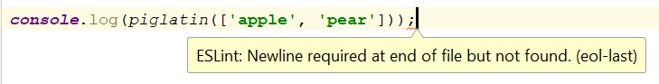

## Coding Standards

Have you ever tried debugging, updating, or contributing to someone else's code but could not follow along or decipher it? Or, maybe you're that someone writing unreadable code. When writing code, everyone starts out with their own style and what they think looks good to them. Throughout my four years in college, I have created my own coding style and adopted different habits based on what I've seen others do. Sometimes I wish I could magically format someone's code into something that I can understand. The only way to create code that is understandable is to adapt coding standards.

Coding standards are guidelines that outline programming styles and practices that should be followed when writing code. Some of these guidelines include: how to organize your files, spacing, comments, and naming conventions. These guidelines can be very specific. For example, using 'for', 'if', and 'if-else' statements, there must be a space between 'for' and the start of your parenthesis. You must be thinking, "is a space really going to make a big difference?" Maybe for a couple lines of code it won't, but with thousands of lines of code, then it helps you see the different blocks of code.

## Achieving the Green Checkmark

For the past week, I've been using ESLint with IntelliJ. ESLint is a tool that will identify and report patterns found in JavaScript while you're typing code into IntelliJ. These reports are shown as errors when you're not following coding standards for JavaScript. Although these are errors, you will still be able to run your code, but code stained with red errors is not a pretty sight. Starting out, I had many errors and it was a pain to figure out what those errors meant and how to fix them. For example, if you do not include an empty line at the end of your code, you will receive the following error below:

  

As I continued to use ESLint with IntelliJ, I knew what would cause some of the errors to appear. So I was able to remember what I needed to do in order to fix those errors as I typed out my code. After fixing those errors, I was awarded with the green checkmark at the top corner of my JavaScript file.

Coding standards should be emphasized and practiced in every coding class. Having uniformed code will not only help other people understand your code, but it will also help you become more organized and a better software engineer.
