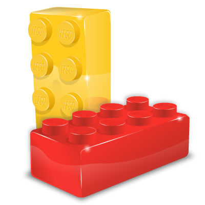
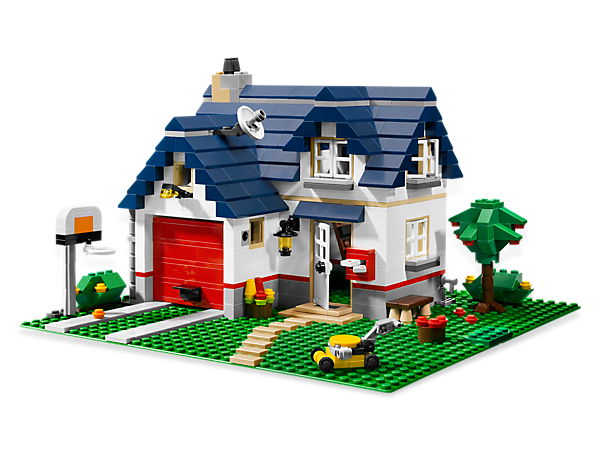

## Creating A Lego Block

  

    
  

A professor once told me, "programming is like creating a bunch of lego pieces and putting them together to create something new." After three years of programming in languages such as C, C++, Java, and JavaScript, I've noticed that the code I've written is broken down into small "lego blocks". Some of these blocks are reusable in multiple different programs, they also could be altered to create new blocks. For example, the input of a function could be different from another, but their structures are somewhat similar. These lego blocks resemble design patterns which are reusable solutions to common problems in software design.

## Types of Lego Blocks

  

    
  

There a three different types of design patterns: structural, creational, and behavioral. Structural patterns identify a simple way to show a relationship between classes or objects. Creational patterns make it easier to create objects that will help the situation. A behavioral pattern is used to make objects and classes easily communicate with each other. 

Using the blocks to create a "lego building"
doors are behavioral 
structureal and 
creationsal