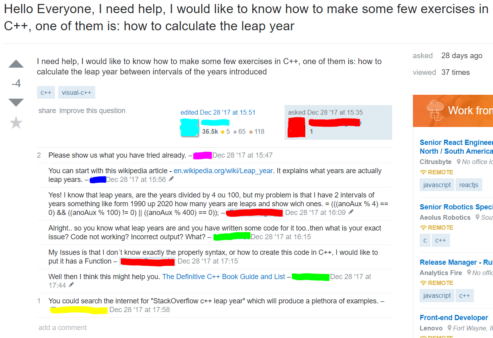
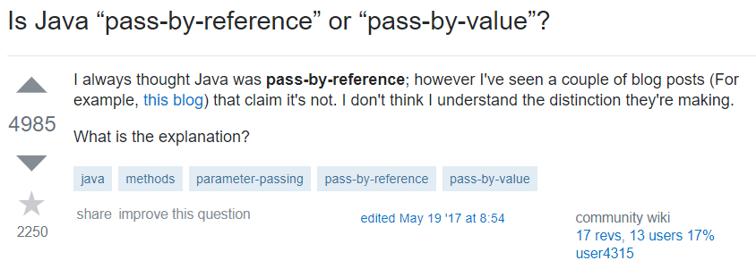

## Good VS. Bad Questions

When looking at questions on StackOverflow, the first thing users see is a list of subject headers to each question. According to Raymond and Moen [1], the subject header is your way of attracting fellow software engineers to your question, similar to the first sentence of an essay. You want them to know more about your question and what you’re having trouble with. You’re subject header should also be descriptive, but concise as well. Looking at figure 1, the subject header is excessive. The phrase, “Hello Everyone, I need help, I would like to know how to make some few exercises” is unnecessary, instead, it should be included in the detailed description of the question. An effective subject header would be: “Calculating Leap Year with C++.” In figure 2, the subject header is a short and concise question, then the question is expanded in the description. In the description of your problem, it should clearly describe the bug, the environment, demonstrate that you researched your problem, and show the steps you took in attempting to solve your problem before posting. In an essay, the description acts as the body. In figure 1’s description, they clearly restate their subject header which defeats the purpose. They also do not include an attempt to solving their question. Showing no attempt, it demonstrates that you are only searching for answers and have no interest in working out the problem. In figure 2’s description, they show that they have researched their problem before posting by including a link to one of the resources. 

In addition to the subject header and description, the responses demonstrate if their question captured the interest of fellow software engineers. The comments in figure 1 show what the post is missing. They asks for an attempt, provide resources that can be easily found in a search engine, and keywords to search for solutions. Figure 1 also shows that their main issue is syntax, which should have been included in their description. In figure 2, the answers include examples of code and detailed explanations. This shows their interest in the question and wanting to help the person understand the problem.  

  

     <figcaption>1) Figure 1: Bad Question Example</figcaption>
     <figcaption>2) Figure 2: Good Question Example </figcaption>
  

