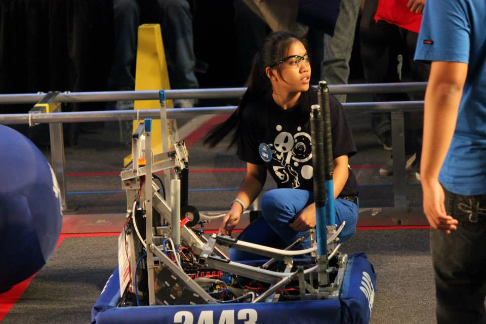

To me, figuring out what you love to do and pursing it as a career is one of the most challenging tasks that we all must overcome. Throughout high school, I took and was part of a variety of electives and clubs, which included: Japanese club, digital media, graphic design, design tech, and robotics, hoping that one of these subjects or extracurricular activity would spark my interest. Out of all the electives and activities I was a part of, robotics was one that I stuck with throughout high school. 

  

    
  

I was a part of Maui High School's FIRST Robotics team, 2443 Blue Thunder. It was separated into three different departments: documenting, programming, and building. As a Freshman, I was unsure if I had the skill set to program or build a robot, so I doubted myself and joined the documenting team. Eventually, I decided to challenge myself and join the building team. They were in charge of designing and fabricating the robot for competition. I remember being the first member ever to switch from documenting to the building team. Everyone questioned my decision, but I was sure that it was something I wanted to do. After a year of being a part of the build team, some of the other members started to ask if I would transfer over to programming. Deep down, I wanted to try something new, however I started to obtain important roles as part of the build team, some of which include: head welder, robot operator, and build team captain. 

My involvement in robotics got me interested in pursing a career in STEM. Even after all the experience and roles I had as part of the build team, I was still unsure what to take on in college. I decided to attend University of Hawaii Maui College (UHMC) for two years while I figured out what I truly wanted to do. During my last semester at UHMC, I took my first programming class. I was fascinated by how a couple lines of code could create something interactive and useful. Once I transferred to UH Manoa, I took another programming class and was officially hooked. 
