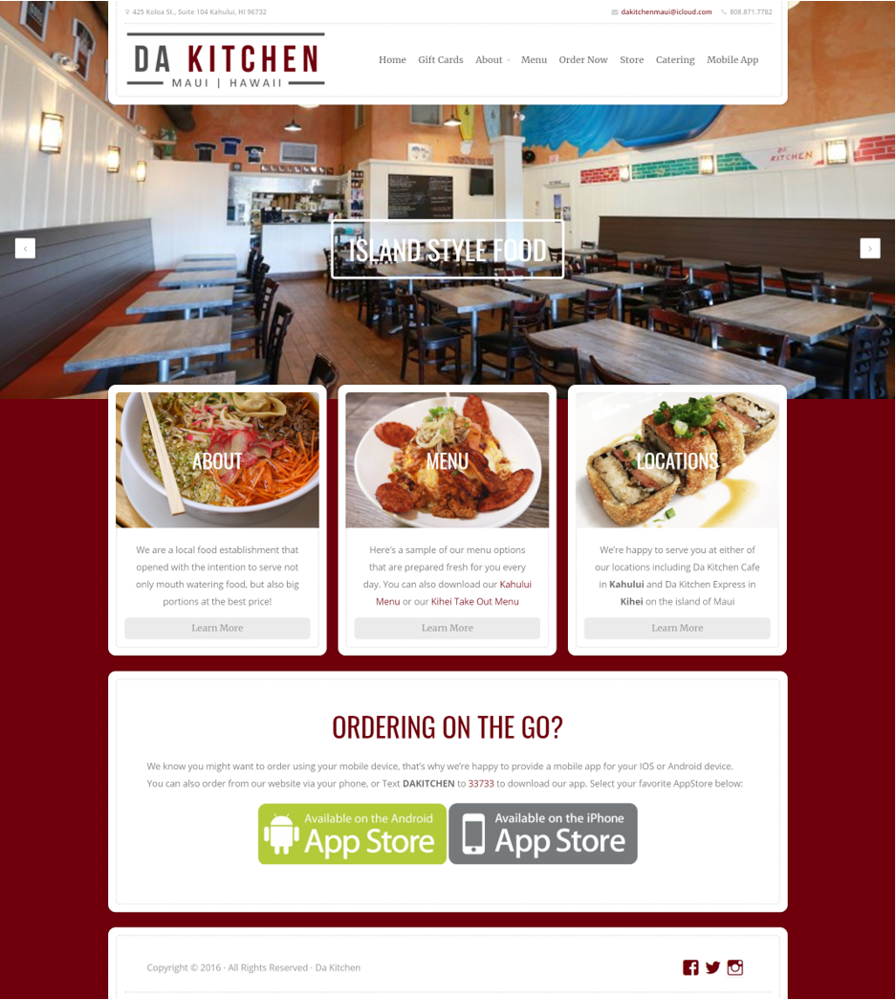
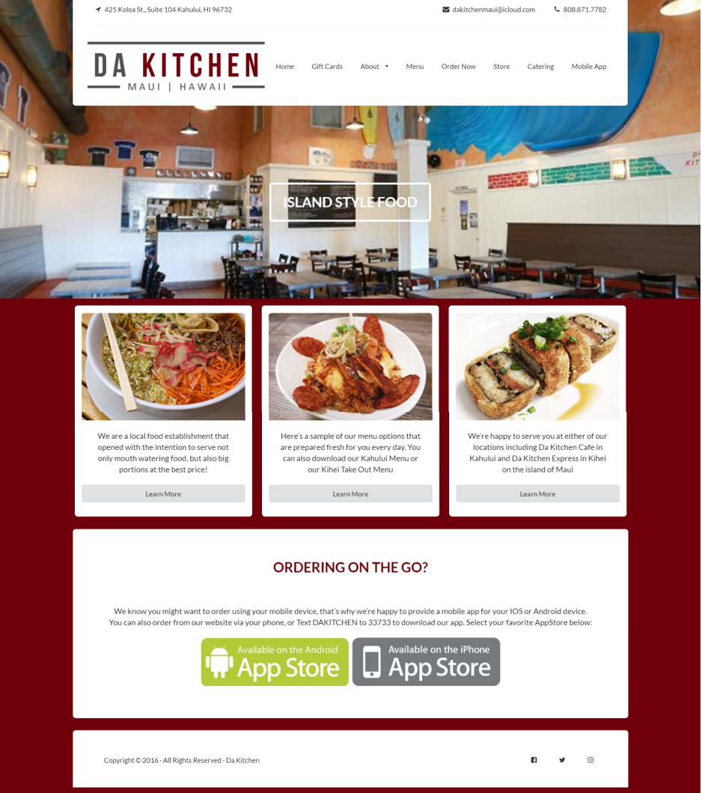
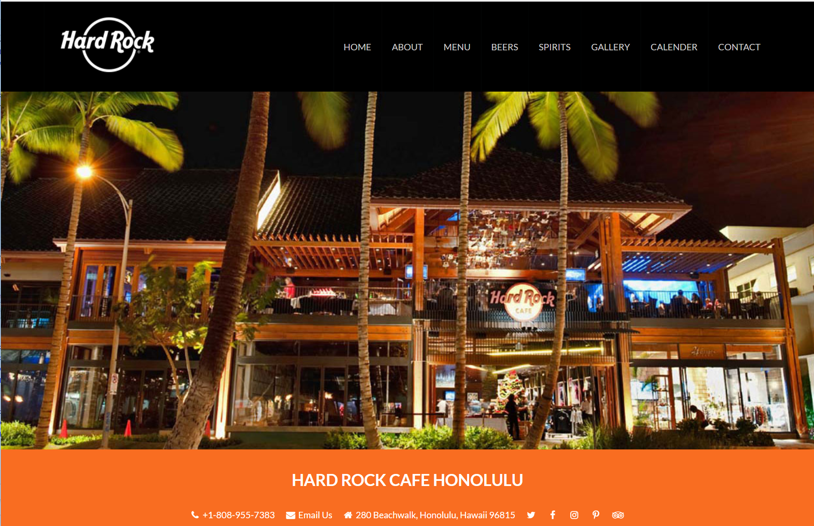

When it comes to websites, the layout, graphics, and how easily it is to navigate through it plays an important role in determining how people view you or the company. A visually appealing and functional website can be achieved, either through raw HTML and CSS, UI Frameworks, or simply a website builder.

This past week, I have been working with Semantic UI to recreate websites of popular local bars and restaurants. At first, Semantic UI was a pain to work with, I did not understand the use for a container, the fonts were not changing color, my drop down menu did not want to drop, and many more. However, as I continued to look through the Semantic UI documentation and work with the different elements, I started to understand how to use and manipulate the elements given to produce a visually appealing and semi-functional website. Below is my take on rebuilding a local restaurant on the island of Maui. On the left is the actual website and on the right is my mock up. 

  

    
    
  

Although Semantic UI was a pain and even still a bit of a pain to work with, I noticed that its also a way to comment your code. For example, when creating a navigation bar, I can name its class, 'ui topmenu menu'. With this naming convention, I could easily identify what section of the website the code is referring to. It also gives you the opportunity to break the website into their own section and organizing them into containers, groups, and items. For example, the website below could be broken down into a navigation bar, body, and footer. Semantic UI lets you combine the contents of these sections together to create an appealing and functional website. 

 