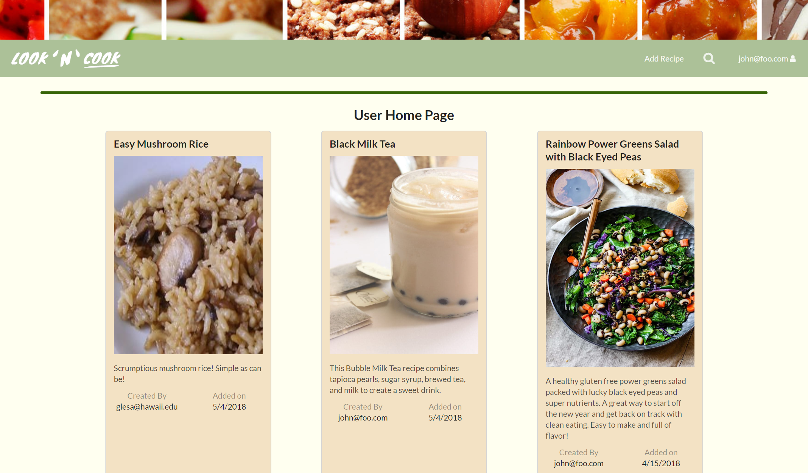
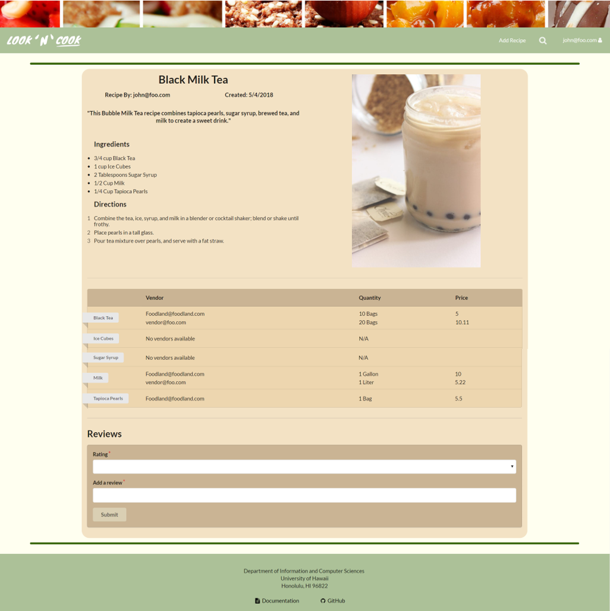
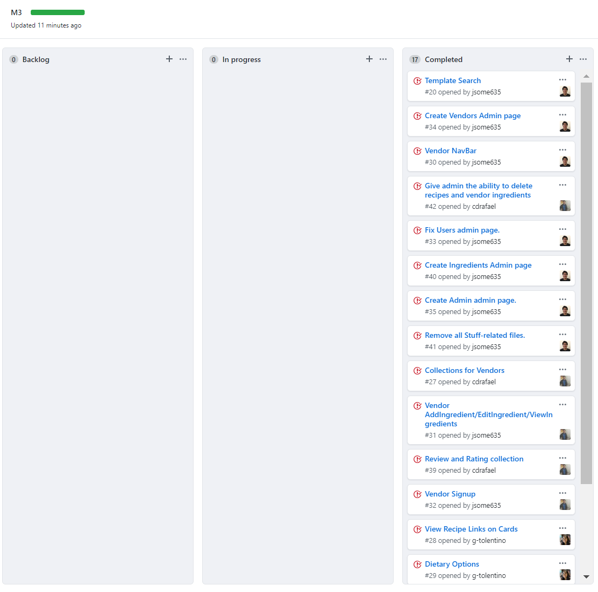

Being one of the thousands of students who dorm on campus, I am constantly wondering what to cook for lunch or dinner. Sometimes I am searching on the web for hours and just end up cooking a packet of ramen or going out and spending money on take out. To solve this situation, <a href="https://jsome635.github.io/">Jacob Somera</a>, <a href="https://cdrafael.github.io/">Charles Rafael</a>, and I created Look 'N' Cook.
 
 
  
Look 'N' Cook is a web application that my team created for our ICS 314 final project. Our goal for this project was to create an application that would provide UH students a way to share their recipes and learn from others. In addition to recipes, vendors such as Foodland, Safeway, and Longs Drugs could create accounts and provide information about the products/ingredients that they have available for purchase.

 

As part of the team, I worked on the user interface and making sure that information is being displayed correctly and in a way that is visually appealing. Working off of the simple cards that my partner, Charles created to test out the recipe collection, I added colors and displayed information about the dietary restriction and creator of each recipe. These cards were used in the home, profile, and search pages. In addition, I was able to link each card to its recipe page which I also took part in creating. For each recipe page, it displayed the recipe's ingredients and steps. The recipe page also displayed possible vendors that sold the ingredients listed in the recipe. 

 

Working on this project, I learned that creating databases and collections take a while to brainstorm and implement. As we were creating different pages, it was difficult to test these pages without having a collection for recipes or vendors. So our main goal for the first two weeks was to implement a collection for recipes. In addition to working in a team, it is sometimes difficult to divide work between members. With this project, my team used "issue driven project management" (IDPM). With the use of milestones in our GitHub repository, we were able to create issues on things that needed to get done with the app. With these issues, each member was able to choose what they wanted to work on. It also gave us a way to visually see what was done and what still needed to be worked on. Managing the project this way, we were able to create different branches for each issue and simultaneously work on the code at the same time. 

Visit our <a href="http://look-n-cook.meteorapp.com/#/">website</a> and GitHub page: <a href="https://look-n-cook.github.io/"><i class="large github icon "></i>Look 'N' Cook</a>
