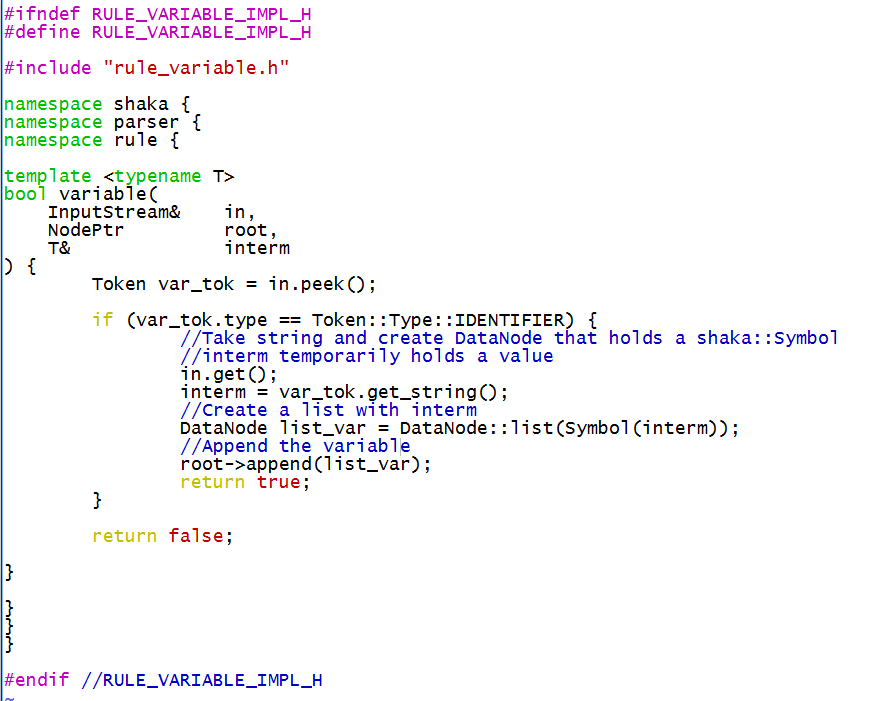
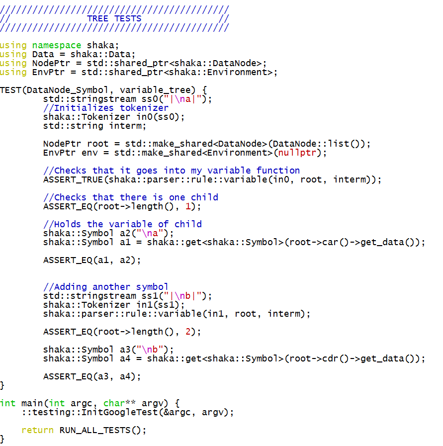
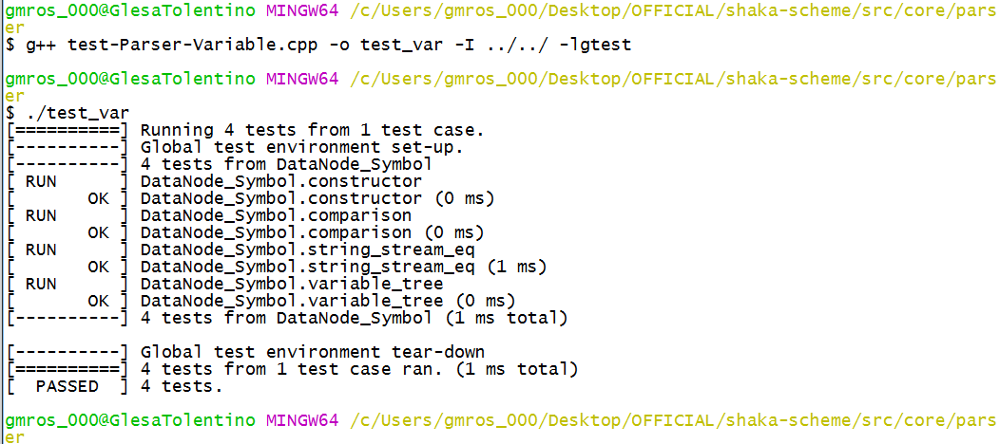

Entering this project, I had very little experience with programming. So I decided to join the Design/Testing team. We started the semester by researching regular language and Backus-Naur Form (BNF). After a couple of weeks of research and trying to understand BNF and regular language, I was moved to the Parsing/IO team. As part of the Parsing/IO team, I used what I learned about BNF and regular language to parse code and create rules for variable and boolean. In addition to coding rules for variable and boolean, I created test cases with Google Test to make sure my rules were producing the correct results.  

Being a part of this project helped me better understand programming languages and their syntax, the concept of parsing, and working with a big team. Having documents like R7RS, helped me create rules for variable and boolean without having a lot of experience with programming in Scheme. Also, working with a big team which consisted of sophomores, juniors, and seniors, it gave me the chance to see their coding habits and how they would tackle a problem.

Source: <a href="https://github.com/uhmanoa-transpiler-project/shaka-scheme"><i class="large github icon "></i>uhmanoa-transpiler-project/shaka-scheme</a>

  

    
    
    
  

  <figcaption>Rule and test case for variable.</figcaption>

