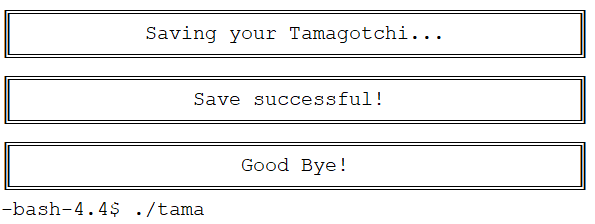

When I was young, I remember Tamagotchi being the hottest toy around. I never owned one, but my cousins did, so I would “tamagotchi sit” theirs. As soon as I found out that one of our final projects for EE205 was to recreate Tamagotchi, I started to brainstorm how to implement what I learned about object oriented programming to the project. 

The first thing I needed to do was figure out the different types of actions you can do with the Tamagotchi. The user could feed, play a game, clean, give medicine, control the lights, and check the Tamagotchi’s health and information. For the feed function, I asked the user to choose between a meal or a snack. The minigame I programmed for the Tamagotchi was a guessing game. The user would guess which way the Tamagotchi was facing, either left or right. If the user won three or more times, it would increase the Tamagotchi’s happiness. The clean function would get rid of the poop that the Tamagotchi created. If the user does not clean it up in time, the Tamagotchi gets sick. To heal the Tamagotchi, the medicine function would determine how much medicines/injections the user would need to give to the Tamagotchi to make it all better. These actions turned out to be functions in my main Tamagotchi class. 

The next thing I did was create classes that were inherited from our main class. For the feed function, I decided that each Tamagotchi age group should have their own feed function. Each age group would have a different meal and snack that the user could choose from. These meals and snacks would also affect the weight of the tamagotchi and maybe increase its happiness. I also added visuals to our Tamagotchi game. There is a main menu and each age group has a different Tamagotchi character. Based on the age group, the random events function controls the Tamagotchi’s health levels,  how it feels, and what it does. For example, a baby Tamagotchi would eat, poop, and sleep more compared to an adult Tamagotchi.

The one thing I liked about this project is that each group was able to add their own creativity and features to their Tamagotchi game. A special feature that I included was the ability to save the Tamagotchi at its current state and continue playing with it at a later time.  

 
  

    
    
    
    
    
    
    
    
    
    
    
  

Source: <a href="https://github.com/g-tolentino/EE205-FinalProject"><i class="large github icon "></i>g-tolentino/EE205-FinalProject</a>

