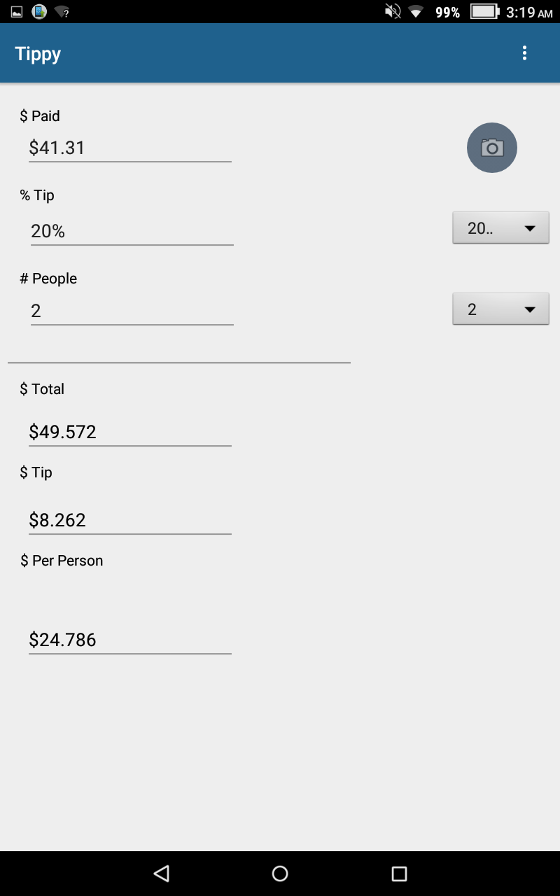

During the 2017 Fall semester, my partner, Jacob Somera and I developed an Android app that calculated the tip of a customer’s bill. In addition, the app was able to dynamically calculate the tip based on a percentage that was chosen and determine how much each person in the group would have to pay. A special feature that we included in our app was the ability to take a picture of the total on the bill instead of having the user input the total. To implement this feature, we used an OCR library. 

I was in charge of understanding and learning about the OCR library. With the OCR library, we were able to use its activities to take a picture of the total and obtain a string of the result. In the early stages of our app, I used this string to parse the total into a double. Using this double, I then calculated the total tip and displayed the results.

While I was working with the OCR, my partner was in charge of creating the user interface for the app. When we got everything working, the next difficult task that we needed to complete was combining OCR to his interface and making sure that the result from the OCR was passed to the “$ Paid” edit text box. To activate the OCR, the camera button on the right would have to be clicked. This was achieved by creating an “intent” and calling the activity that runs the OCR. To pass the OCR result, we were able to pass the public variables and functions in the Main activity to the OCR activity. At the end of the semester, we presented our app to other students who were a part of the Android App and Arduino projects.

